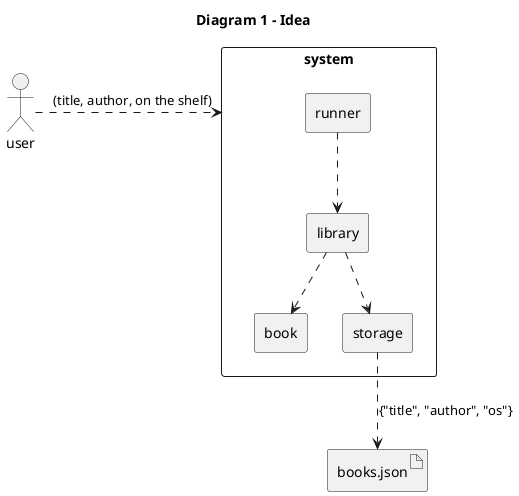
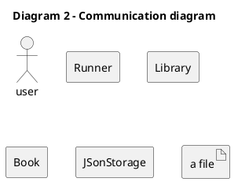
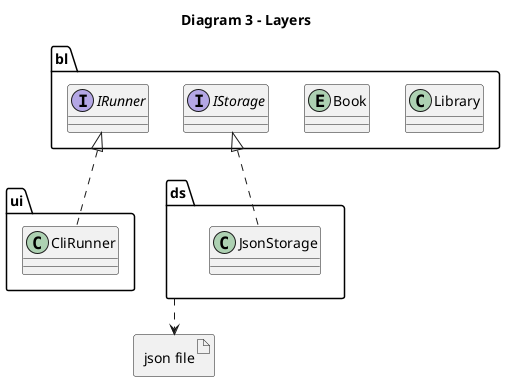
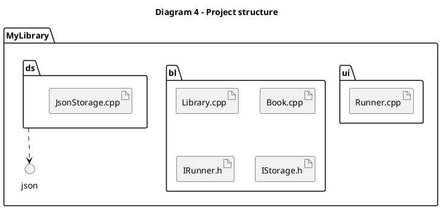
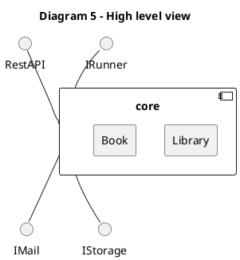

And the UMLs.

```plantuml
@startuml
title Diagram 1 - Idea
actor user

rectangle system {
rectangle runner
rectangle library
rectangle book

rectangle storage
    runner ..> library
    library ..> book
    library ..> storage
}

artifact books.json

user .> system : (title, author, on the shelf)
storage ..> books.json : {"title", "author", "os"}
@enduml
```

```plantuml
@startuml
title Diagram 2 - Communication diagram

actor user
rectangle Runner
rectangle Library
rectangle Book
rectangle JSonStorage
artifact "a file" as file
@enduml
```

```plantuml
@startuml
title Diagram 3 - Layers

allowmixing

package ui {
class CliRunner
}

package bl {
class Library
entity Book
interface IRunner
interface IStorage
}

package ds {
class JsonStorage
}

artifact "json file" as json

IRunner <|.. CliRunner
IStorage <|.. JsonStorage

ds ..> json
@enduml
```

```plantuml
@startuml
title Diagram 4 - Project structure

package MyLibrary {
    package ui {
        artifact Runner.cpp
    }
    
    package bl {
    artifact Library.cpp
    artifact Book.cpp
    artifact IRunner.h
    artifact IStorage.h
    }
    
    package ds {
    artifact JsonStorage.cpp
    }
    
    ds ..> json
}
@enduml
```

```plantuml
@startuml
title Diagram 5 - High level view

component core {
    rectangle Library
    rectangle Book
}

interface IRunner
interface IMail
interface RestAPI
interface IStorage

core -up- IRunner
core -down- IMail
core -up- RestAPI
core -down- IStorage
@enduml
```
